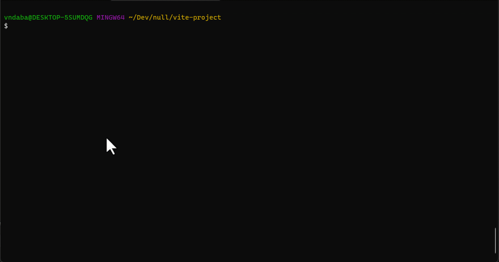

# Tailwind Init (twinit)



With the twinit CLI, you no longer have to setup tailwind manually. It auto detects the framework that you are using and the preferred package manager. You simply invoke a simple command and the CLI scaffolds everything you need to get up and running with tailwind on your framework of choice. The following frameworks are currently supported, with support for more being worked on:

- [x] CRA
- [x] Preact
- [x] Next.js
- [x] Gatsby.js
- [x] Remix
- [x] Astro
- [x] Vue.js
- [x] Angular
- [x] Ruby on rails
- [x] Nuxt.js v2 and v3
- [x] Solid.js
- [x] Svelte Kit
- [x] Svelte + Rollup
- [x] Laravel
- [x] Vite using: `React`, `Vue`, `Svelte`

## Simply run:

```bash
npx twinit
```

## CLI Options

You can pass the following options to the CLI

```bash
npx twinit --skip-deps # this will skip deps and modify config files only
# or npx twinit -s

npx twinit --only-deps # this will only install the deps
# or npx twinit -d
```
